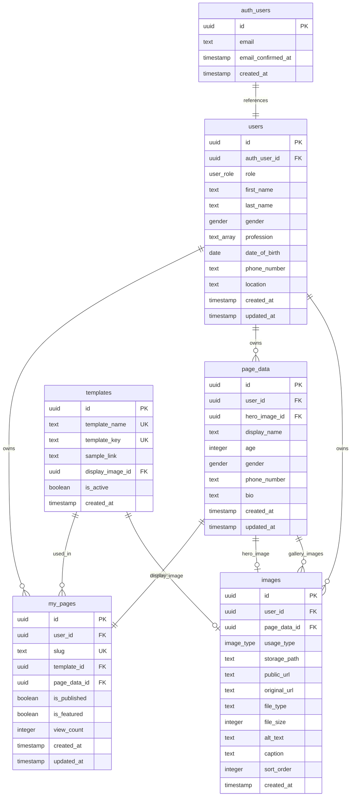
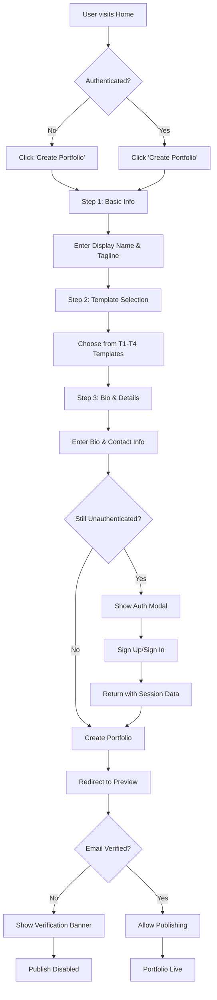
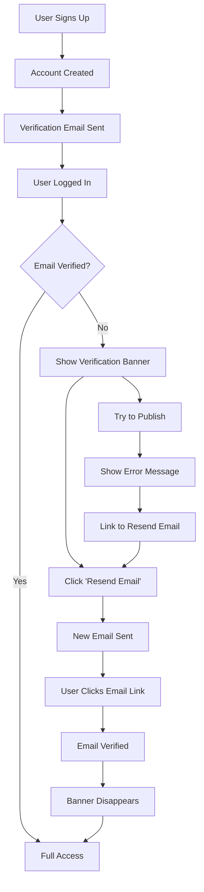

# Spotlight

**Create professional portfolios in under 5 minutes**

[](https://nextjs.org/)
[](https://www.typescriptlang.org/)
[](https://supabase.com/)
[](https://tailwindcss.com/)
[](https://opensource.org/licenses/MIT)

---

## Overview

Spotlight is a modern web application that enables actors and models to create professional online portfolios with minimal effort. The platform focuses on **simplicity**, **performance**, and **SEO optimization** to help users showcase their work effectively.

### Vision Statement
To democratize professional portfolio creation for actors and models by providing an intuitive, fast, and SEO-optimized platform that can be set up in under 5 minutes.

### Target Audience
- **Primary:** Actors and models seeking professional online presence
- **Secondary:** Creative professionals, performers, and artists

### Key Value Propositions
- **Speed:** Portfolio creation in under 5 minutes
- **Simplicity:** Minimal learning curve with intuitive interface
- **Performance:** Lighthouse score 90+ with fast load times
- **SEO Optimization:** Server-side rendered pages with Schema.org markup
- **Mobile-First:** Responsive design for all devices

---

## Technology Stack

### Core Technologies
- **Frontend:** Next.js 15+ (App Router)
- **Backend:** Supabase (Authentication, Database, Storage, Edge Functions)
- **Styling:** Tailwind CSS + shadcn/ui components
- **Language:** TypeScript
- **Deployment:** Vercel (recommended)

### Additional Libraries
- **Internationalization:** next-intl
- **Validation:** Zod
- **Image Optimization:** Next.js Image component
- **SEO:** Schema.org markup, Open Graph meta tags

---

## Project Structure

```
spotlight/
├── src/
│   ├── app/                    # Next.js 15 App Router
│   │   ├── [locale]/          # Internationalized routes
│   │   │   ├── page.tsx       # Home page
│   │   │   ├── create/        # Portfolio creation flow
│   │   │   ├── preview/       # Portfolio preview
│   │   │   ├── edit/          # Portfolio editor
│   │   │   └── profile/       # User profile
│   │   ├── mypage/            # Public portfolio pages (no locale)
│   │   │   └── [slug]/        # Individual portfolio pages
│   │   ├── api/               # API routes
│   │   │   ├── auth/          # Authentication endpoints
│   │   │   ├── portfolios/    # Portfolio management
│   │   │   ├── users/         # User management
│   │   │   ├── images/        # Image handling
│   │   │   ├── templates/     # Template management
│   │   │   └── public/        # Public API endpoints
│   │   ├── globals.css        # Global styles
│   │   ├── layout.tsx         # Root layout
│   │   ├── loading.tsx        # Loading UI
│   │   ├── error.tsx          # Error boundary
│   │   ├── not-found.tsx      # 404 page
│   │   └── sitemap.ts         # Dynamic sitemap
│   ├── components/            # Reusable UI components
│   │   ├── ui/                # shadcn/ui components
│   │   │   ├── button.tsx
│   │   │   ├── input.tsx
│   │   │   ├── card.tsx
│   │   │   └── ...
│   │   ├── layout/            # Layout components
│   │   │   ├── navbar.tsx
│   │   │   ├── footer.tsx
│   │   │   └── announcement-banner.tsx
│   │   ├── forms/             # Form components
│   │   │   ├── portfolio-creation-form.tsx
│   │   │   ├── profile-form.tsx
│   │   │   └── auth-forms.tsx
│   │   ├── templates/         # Portfolio templates
│   │   │   ├── template-1.tsx # Classic Professional
│   │   │   ├── template-2.tsx # Modern Bold
│   │   │   ├── template-3.tsx # Minimal Elegant
│   │   │   ├── template-4.tsx # Creative Artistic
│   │   │   └── template-renderer.tsx
│   │   └── portfolio/         # Portfolio-specific components
│   │       ├── portfolio-card.tsx
│   │       ├── portfolio-editor.tsx
│   │       └── image-upload.tsx
│   ├── lib/                   # Utilities and configurations
│   │   ├── supabase/          # Supabase client & configuration
│   │   │   ├── client.ts      # Supabase client
│   │   │   ├── server.ts      # Server-side client
│   │   │   └── types.ts       # Database types
│   │   ├── validations/       # Zod validation schemas
│   │   │   ├── auth.ts
│   │   │   ├── portfolio.ts
│   │   │   └── user.ts
│   │   ├── utils/             # Helper functions
│   │   │   ├── cn.ts          # Class name utility
│   │   │   ├── image.ts       # Image processing
│   │   │   └── seo.ts         # SEO utilities
│   │   └── constants/         # Application constants
│   │       ├── templates.ts
│   │       └── routes.ts
│   ├── hooks/                 # Custom React hooks
│   │   ├── use-auth.ts        # Authentication hook
│   │   ├── use-portfolio.ts   # Portfolio management
│   │   └── use-image-upload.ts
│   ├── types/                 # TypeScript type definitions
│   │   ├── portfolio.ts
│   │   ├── user.ts
│   │   └── template.ts
│   └── messages/              # Internationalization files
│       ├── en.json            # English translations
│       └── es.json            # Spanish translations
├── public/                    # Static assets
│   ├── images/                # Static images
│   ├── icons/                 # App icons
│   └── favicon.ico
├── docs/                      # Documentation
│   ├── PRD.md                 # Product Requirements Document
│   ├── api.md                 # API Documentation
│   └── deployment.md          # Deployment Guide
├── supabase/                  # Supabase configuration
│   ├── migrations/            # Database migrations
│   ├── functions/             # Edge functions
│   └── seed.sql               # Initial data
├── .env.local.example         # Environment variables template
├── next.config.js             # Next.js configuration
├── tailwind.config.js         # Tailwind CSS configuration
├── tsconfig.json              # TypeScript configuration
└── package.json               # Dependencies and scripts
```

---

## Database Schema

### Entity Relationship Diagram



### Database Enums
- **USER_ROLE:** `'GENERAL' | 'ADMIN' | 'SUB_ADMIN'`
- **GENDER:** `'MALE' | 'FEMALE' | 'NB' | 'PNTS'`
- **IMAGE_TYPE:** `'PROFILE' | 'HERO' | 'GALLERY'`

---

## User Flow Diagrams

### Portfolio Creation Flow



### Email Verification Flow



---

## Quick Start

### Prerequisites
- Node.js 18+ 
- npm or yarn
- Supabase account
- Vercel account (for deployment)

### Installation

1. **Clone the repository**
   ```bash
   git clone https://github.com/your-username/spotlight.git
   cd spotlight
   ```

2. **Install dependencies**
   ```bash
   npm install
   # or
   yarn install
   ```

3. **Environment Setup**
   ```bash
   cp .env.local.example .env.local
   ```
   
   Fill in your environment variables:
   ```env
   # Supabase
   NEXT_PUBLIC_SUPABASE_URL=your_supabase_url
   NEXT_PUBLIC_SUPABASE_ANON_KEY=your_supabase_anon_key
   SUPABASE_SERVICE_ROLE_KEY=your_service_role_key
   
   # Next.js
   NEXTAUTH_URL=http://localhost:3000
   NEXTAUTH_SECRET=your_nextauth_secret
   
   # Optional: AI Integration (Day 2 feature)
   OPENAI_API_KEY=your_openai_key
   ```

4. **Database Setup**
   ```bash
   # Run Supabase migrations
   npx supabase db reset
   
   # Seed initial data
   npx supabase db seed
   ```

5. **Start Development Server**
   ```bash
   npm run dev
   # or
   yarn dev
   ```

6. **Open your browser**
   Navigate to [http://localhost:3000](http://localhost:3000)

---

## Features

### Core Features (Phase 1)
- **5-Minute Portfolio Creation** - Streamlined 3-step process
- **4 Professional Templates** - Classic, Modern, Minimal, Creative
- **Mobile-First Design** - Responsive across all devices
- **Secure Authentication** - Supabase Auth with email verification
- **Advanced Image Processing** - WebP conversion, multiple sizes, lazy loading
- **SEO Optimized** - Schema.org markup, Open Graph, Twitter Cards
- **Internationalization** - English and Spanish support
- **Analytics Ready** - View counting and engagement tracking

### Email Verification System
- **Non-blocking Flow** - Users can create and edit without verification
- **Publishing Restriction** - Email verification required for publishing
- **Smart Banners** - Contextual announcements with resend functionality
- **Real-time Updates** - Banner disappears when email is verified

### Performance Targets
- **Lighthouse Score:** 90+ across all metrics
- **Page Load Time:** < 2 seconds (LCP)
- **Mobile Usability:** 100% score
- **SEO Score:** 95+

---

## API Documentation

### Authentication Endpoints
```typescript
POST /api/auth/signup              // User registration
POST /api/auth/signin              // User login  
POST /api/auth/signout             // User logout
POST /api/auth/resend-verification // Resend verification email
```

### Portfolio Management
```typescript
GET    /api/portfolios             // Get user's portfolios
POST   /api/portfolios             // Create new portfolio
GET    /api/portfolios/[id]        // Get specific portfolio
PUT    /api/portfolios/[id]        // Update portfolio
DELETE /api/portfolios/[id]        // Delete portfolio
PATCH  /api/portfolios/[id]/publish // Toggle publish status
```

### Public Endpoints
```typescript
GET  /api/public/featured          // Get featured portfolios
GET  /api/public/mypage/[slug]     // Get public portfolio data
POST /api/public/view/[slug]       // Increment view count
```

### Template & Image Management
```typescript
GET    /api/templates              // Get available templates
POST   /api/images/upload          // Upload image to storage
DELETE /api/images/[id]            // Delete image
```

---

## Deployment

### Vercel Deployment (Recommended)

1. **Connect to Vercel**
   ```bash
   npm install -g vercel
   vercel --prod
   ```

2. **Environment Variables**
   Add all environment variables in Vercel dashboard

3. **Domain Configuration**
   - Set up custom domain in Vercel
   - Configure DNS records
   - SSL automatically handled

### Supabase Configuration

1. **Database Setup**
   - Run migrations in production
   - Set up Row Level Security policies
   - Configure storage buckets

2. **Authentication**
   - Configure redirect URLs
   - Set up email templates
   - Enable social providers (optional)

---

## Development Guidelines

### Code Style
- **TypeScript** - Strict mode enabled
- **ESLint** - Extended Next.js configuration
- **Prettier** - Consistent code formatting
- **Tailwind CSS** - Utility-first styling approach

### Git Workflow
```bash
# Feature development
git checkout -b feature/your-feature-name
git commit -m "feat: add your feature description"
git push origin feature/your-feature-name

# Create pull request
# After review and approval, merge to main
```

### Testing Strategy
- **Unit Tests** - Jest + React Testing Library
- **Integration Tests** - API route testing
- **E2E Tests** - Playwright (optional)
- **Performance Tests** - Lighthouse CI

### Performance Requirements
- **Lighthouse Performance:** 90+
- **Lighthouse SEO:** 95+
- **Lighthouse Accessibility:** 90+
- **Lighthouse Best Practices:** 90+

---

## Contributing

We welcome contributions! Please see our [Contributing Guidelines](CONTRIBUTING.md) for details.

### Development Process
1. Fork the repository
2. Create a feature branch
3. Make your changes
4. Add tests if applicable
5. Ensure all tests pass
6. Submit a pull request

### Reporting Issues
- Use GitHub Issues for bug reports
- Include reproduction steps
- Add screenshots if applicable
- Specify environment details

---

## Roadmap

### Phase 1 (Current) - Core Features
- [ ] Project setup and configuration
- [ ] Database schema implementation
- [ ] Authentication system with email verification
- [ ] Basic portfolio creation flow
- [ ] Template system (4 templates)
- [ ] Home page with featured portfolios
- [ ] Image upload and processing
- [ ] SEO optimization

### Phase 2 (Day 2) - Enhanced Features
- [ ] AI bio enhancement integration
- [ ] Advanced analytics
- [ ] Enhanced footer and additional pages
- [ ] Performance optimizations
- [ ] Advanced error handling
- [ ] User feedback system

### Phase 3 (Future) - Advanced Features
- [ ] Custom domains
- [ ] Mobile application
- [ ] Advanced analytics dashboard
- [ ] Integration with external platforms
- [ ] Premium features and monetization

---

## License

This project is licensed under the MIT License - see the [LICENSE](LICENSE) file for details.

---

## Acknowledgments

- [Next.js](https://nextjs.org/) - The React framework for production
- [Supabase](https://supabase.com/) - The open source Firebase alternative
- [Tailwind CSS](https://tailwindcss.com/) - A utility-first CSS framework
- [shadcn/ui](https://ui.shadcn.com/) - Beautifully designed components

---

## Support

- **Documentation:** [docs/](./docs/)
- **Issues:** [GitHub Issues](https://github.com/your-username/spotlight/issues)
- **Discussions:** [GitHub Discussions](https://github.com/your-username/spotlight/discussions)
- **Email:** support@spotlight.dev

---

**Built with ❤️ for the creative community**